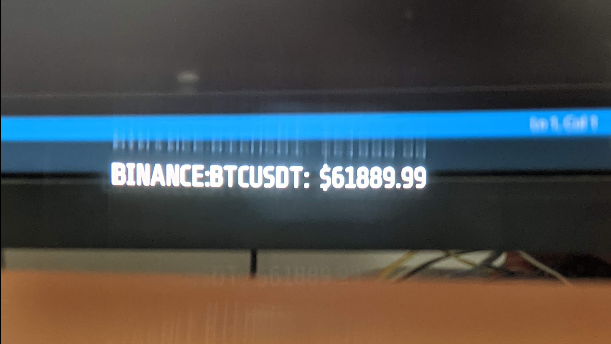
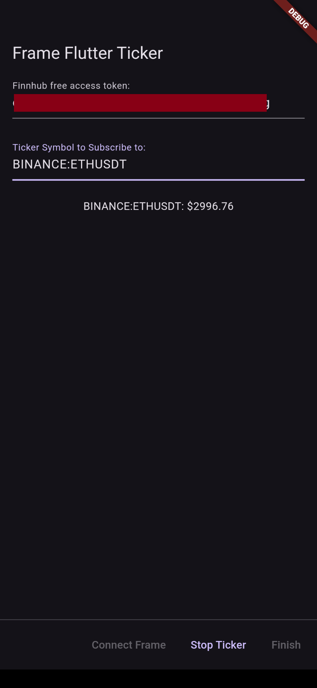

# frame_flutter_ticker (stock/crypto ticker streaming over websockets to Frame)

Subscribes to a [Finnhub.io](https://finnhub.io) ticker symbol using WebSockets and pushes updates to Frame display.

First register on [Finnhub.io](https://finnhub.io) for a free API key which must be provided for data subscription to work.

### Frameshots, Screenshots

### Architecture

### See Also
- [Frame Flutter Hello Hello](https://github.com/CitizenOneX/frame_flutter_hellohello)
